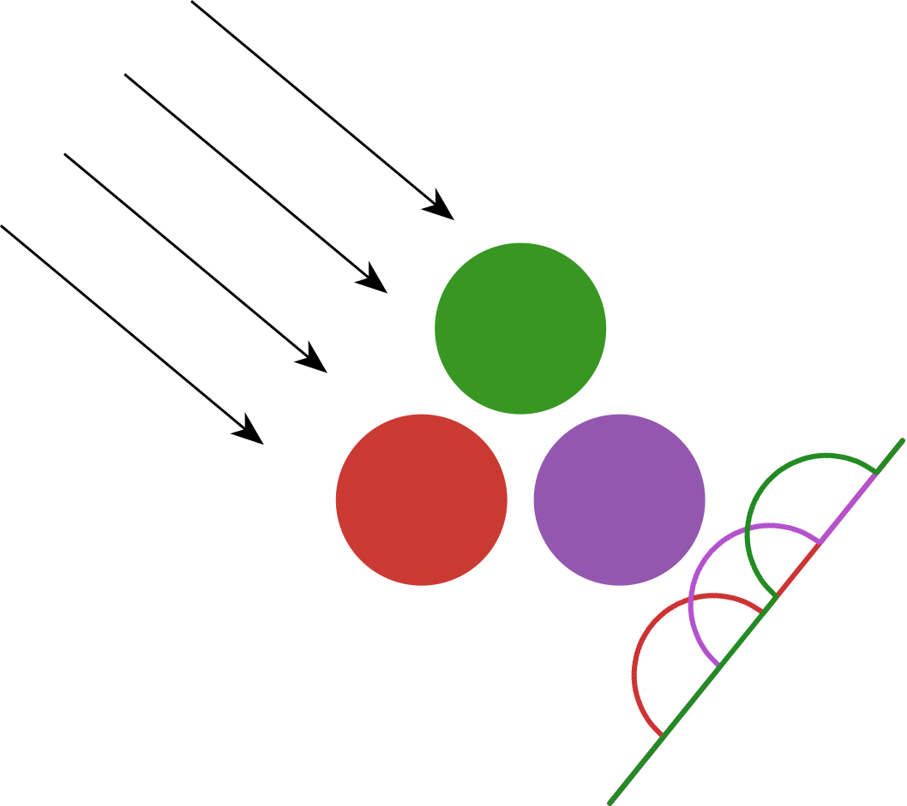
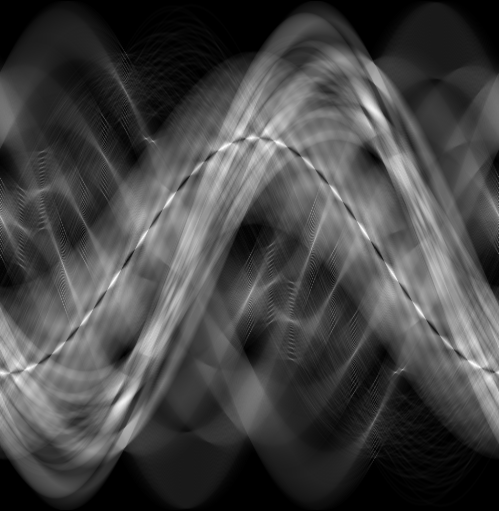
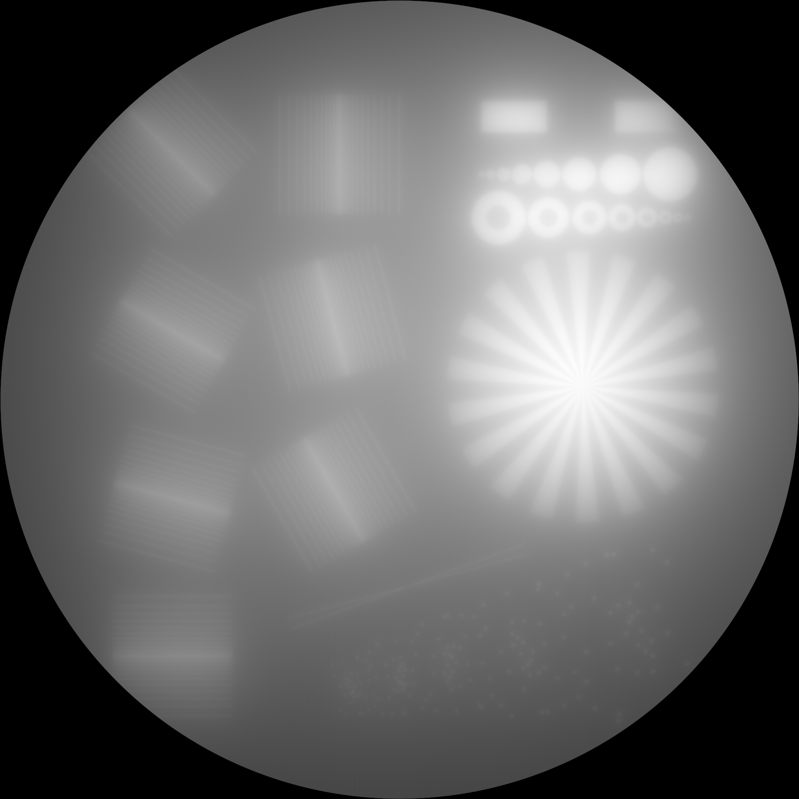

# RadonKA.jl
A simple yet sufficiently fast Radon and inverse Radon (iradon) transform implementation using [KernelAbstractions.jl](https://github.com/JuliaGPU/KernelAbstractions.jl).

<a  href="docs/src/assets/RadonKA_logo.png"></a>

[](https://github.com/roflmaostc/RadonKA.jl/actions/workflows/CI.yml?query=branch%3Amain)
[](https://codecov.io/gh/roflmaostc/RadonKA.jl) [](https://roflmaostc.github.io/RadonKA.jl/stable) [](https://roflmaostc.github.io/RadonKA.jl/dev)


# Quick Overview
* [x] For 2D and 3D arrays 
* [x] parallel `radon` and `iradon`
* [x] arbitrary (2D) geometries can be specified with `ray_startpoints` and `ray_endpoints` 
* [x] attenuated `radon` and `iradon` (see this [paper](https://iopscience.iop.org/article/10.1088/0266-5611/17/1/309/meta) as reference)
* [x] It is restricted to the incircle of radius `N ÷ 2 - 1` if the array has size `(N, N, N_z)`
* [x] based on [KernelAbstractions.jl](https://github.com/JuliaGPU/KernelAbstractions.jl)
* [x] tested on `CPU()` and `CUDABackend`
* [x] registered adjoint rules for both `radon` and `iradon`

# Installation
Requires Julia at least 1.9
```julia
julia> ]add RadonKA
```


# Simple use
```julia
using RadonKA, ImageShow, ImageIO, TestImages

img = Float32.(testimage("resolution_test_512"))

angles = range(0f0, 2f0π, 500)[begin:end-1]

# 0.196049 seconds (145 allocations: 1009.938 KiB)
@time sinogram = radon(img, angles);

# 0.268649 seconds (147 allocations: 1.015 MiB)
@time backproject = RadonKA.iradon(sinogram, angles);

simshow(sinogram)
simshow(backproject)
```
<a  href="docs/src/assets/sinogram.png"></a>
<a  href="docs/src/assets/radonka_iradon.png"></a>

# Examples
See either the [documentation](https://roflmaostc.github.io/RadonKA.jl/dev/tutorial).
Otherwise, this [example](https://github.com/roflmaostc/RadonKA.jl/blob/main/examples/example_radon_iradon.jl) shows the main features, including CUDA support.
There is one tutorial about [Gradient Descent optimization](https://github.com/roflmaostc/RadonKA.jl/blob/main/examples/CT_with_optimizer.jl).
Another one covers how the Radon transform is used in [Volumetric Additive Manufacturing](https://github.com/roflmaostc/RadonKA.jl/blob/main/examples/volumetric_printing.jl).

# Development
File an [issue](https://github.com/roflmaostc/RadonKA.jl/issues) on [GitHub](https://github.com/roflmaostc/RadonKA.jl) if you encounter any problems.


# Similar packages

## Python
There is [TIGRE](https://github.com/CERN/TIGRE) and [ASTRA](https://github.com/astra-toolbox/astra-toolbox) which both offer more functionality for classic CT problems.
They also feature GPU acceleration, however we did not observe that they outperform this package. Also, they don't allow to calculate the attenuated Radon transform
and don't allow for arbitrary ray geometries, as we do.

## Julia
There exists [Sinograms.jl](https://github.com/JuliaImageRecon/Sinograms.jl) and in general the whole [JuliaImageRecon](https://github.com/JuliaImageRecon) organization.
Again, no arbitrary geometries can be specified. And also no attenuated Radon transform is possible.

## Matlab
Matlab has built-in a `radon` and `iradon` transform which is similar to our lightweight API. However, no CUDA acceleration, no 3D arrays and no attenuated Radon transform.
