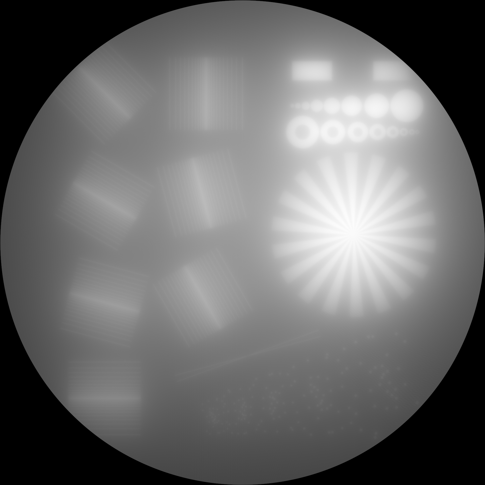

# RadonKA.jl
A simple yet sufficiently fast Radon and adjoint Radon (backproject) transform implementation using [KernelAbstractions.jl](https://github.com/JuliaGPU/KernelAbstractions.jl).

```@raw html
<a  href="assets/RadonKA_logo.png"></a>
```

[](https://github.com/roflmaostc/RadonKA.jl/actions/workflows/CI.yml?query=branch%3Amain)
[](https://codecov.io/gh/roflmaostc/RadonKA.jl) [](https://roflmaostc.github.io/RadonKA.jl/stable) [](https://roflmaostc.github.io/RadonKA.jl/dev)


# Quick Overview
* [x] For 2D and 3D arrays 
* [x] parallel `radon` and `backproject` (`?RadonParallelCircle`)
* [x] attenuated `radon` and `backproject` (see the parameter `μ`)
* [x] arbitrary 2D geometries where starting and endpoint of each ray can be specified (fan beam could be a special case if this) (`?RadonFlexibleCircle`)
* [x] It is restricted to the incircle of radius `N ÷ 2 - 1` if the array has size `(N, N, N_z)`
* [x] based on [KernelAbstractions.jl](https://github.com/JuliaGPU/KernelAbstractions.jl)
* [x] tested on `CPU()` and `CUDABackend`
* [x] registered adjoint rules for both `radon` and `backproject`
* [x] high performance however not ultra high performance
* [x] simple API

# Installation
Requires Julia 1.9
```julia
julia> ]add RadonKA
```

# Simple use
```julia
using RadonKA, ImageShow, ImageIO, TestImages

img = Float32.(testimage("resolution_test_512"))

angles = range(0f0, 2f0π, 500)[begin:end-1]

# 0.196049 seconds (145 allocations: 1009.938 KiB)
@time sinogram = radon(img, angles);

# 0.268649 seconds (147 allocations: 1.015 MiB)
@time backproject = RadonKA.backproject(sinogram, angles);

simshow(sinogram)
simshow(backproject)
```

```@raw html
<a  href="assets/sinogram.png"></a>
<a  href="assets/radonka_backproject.png"></a>
```

# Examples
See either the [documentation](https://roflmaostc.github.io/RadonKA.jl/dev/tutorial).
Otherwise, this [example](https://github.com/roflmaostc/RadonKA.jl/blob/main/examples/example_radon_backproject.jl) shows the main features, including CUDA support.
There is one tutorial about [Gradient Descent optimization](https://github.com/roflmaostc/RadonKA.jl/blob/main/examples/CT_with_optimizer.jl).
Another one covers how the Radon transform is used in [Volumetric Additive Manufacturing](https://github.com/roflmaostc/RadonKA.jl/blob/main/examples/volumetric_printing.jl).

# Development
File an [issue](https://github.com/roflmaostc/RadonKA.jl/issues) on [GitHub](https://github.com/roflmaostc/RadonKA.jl) if you encounter any problems.


